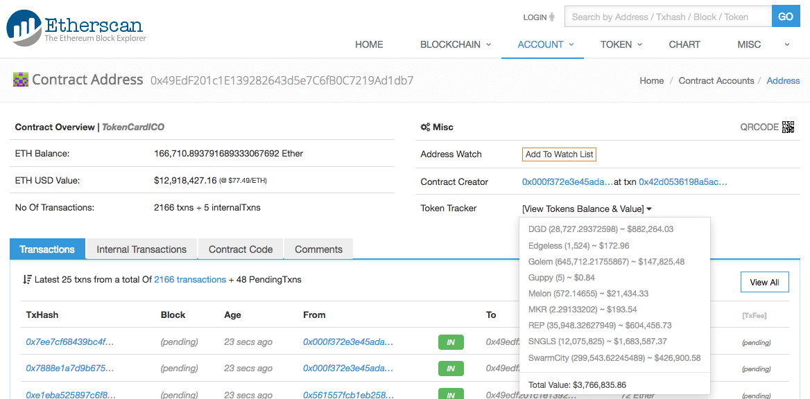
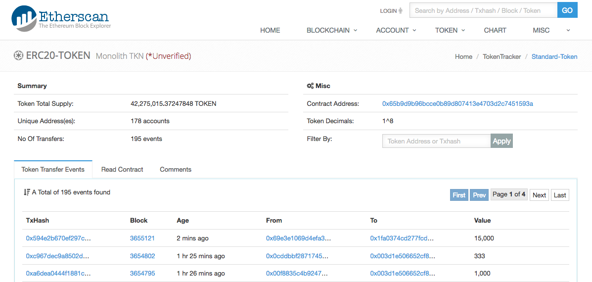
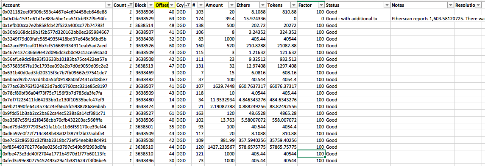

# TokenCard ICO Analysis (Work in progress)

The TokenCard TKN ICO commenced at May-02-2017 04:01:03 PM +UTC and closed 30 minutes 13 seconds later at May-02-2017 04:31:16 PM +UTC.

A total of USD 16,685,263.02 (exchange rate shortly after the closed) was raised, but there were some major bugs in the distribution of the tokens.

The contributions and issued tokens have been reconciled in this report, with the major errors listed below.

TokenCard will have to deploy a new TKN token contract with the correct figures. Individuals who have been sold TKN tokens on the old TKN contract may have lost some ethers in exchange of the worthless old TKN tokens.

<br />

<hr />

**Table of contents**
* [Summary](#summary)
* [Details](#details)
  * [SNGLS x10 Error]()
  * [Bonus Factor](#bonus-factor)
* [Scripts And Data](#scripts-and-data)
  * [Scripts](#scripts)
  * [Raw Data](#raw-data)
  * [Reconciliation Spreadsheet](#reconciliation-spreadsheet)
* [References](#references)
* [ICO Source Code](#ico-source-code)
  * [ICO Contract Source Code](#ico-contract-source-code)
  * [TKN Token Contract Source Code](#tkn-token-contract-source-code)
  * [Common.sol](#commonsol)

<br />

<hr />

## Summary

<br />

<hr />

## Details

ICO Address: [0x49edf201c1e139282643d5e7c6fb0c7219ad1db7](https://etherscan.io/address/0x49edf201c1e139282643d5e7c6fb0c7219ad1db7)

* Funds raised, the USD equivalents at 02:43:04 May 03 2017 AEST just after the ICO closed, and the USD price used in the token crediting computation follows:

      Currency                         Amount  USD Equivalent USD Crediting Rate (1)
      -------- ------------------------------ --------------- ----------------------
      ETH          166,710.893791689333067692   12,918,427.16              75.00
      DGD           28,727.29372598                882,264.03              30.408
      EDG            1,524                             172.96  no credits provided
      GNT          645,712.21755867                147,825.48               0.203
      GUP                5                               0.84  no credits provided
      MLN              572.14655                    21,434.33              36.70
      MKR                2.29133202                    193.54              75.40
      REP           35,948.32627949                604,456.73              16.12
      SNGLS     12,075,825                       1,683,587.37               0.1029
      SWT          299,543.62245489                426,900.58               1.38 
      -------- ------------------------------ --------------- ----------------------
      Total                                     16,685,263.02
      -------- ------------------------------ --------------- ----------------------



TKN Token Address With Incorrect Balance: [0x65b9d9b96bcce0b89d807413e4703d2c7451593a](https://etherscan.io/address/0x65b9d9b96bcce0b89d807413e4703d2c7451593a)

* 42,275,015.37247848 TKN tokens were created



First ICO transaction: [0x7f414c84...](https://etherscan.io/tx/0x7f414c849a74122219a040115d6beab782c7bfefe5ccd66624eb23619aaa0eb5) in block #3638466 at May-02-2017 04:01:03 PM +UTC .

Last non-zero ICO transaction: [0xce7c2a9e...](https://etherscan.io/tx/0xce7c2a9ee12480ced78d4ec940fc8776a872d6455e6acf62de8cbd3b0dd175f6) in block #3638577 at May-02-2017 04:31:16 PM +UTC .

Funding period: 30 minutes 13 seconds

### SNGLS x10 Error

The major error with the crowdsale token distribution is caused by the price for SNGLS being set to a number 10x too high. See the **SNGLS** worksheet within [results/TokenCardICODistribution.xlsx](results/TokenCardICODistribution.xlsx) for the details.


### DGD Does Not Have A x10 Error

The post [TokenCard Tech Roundup and ERC20 Crediting](http://vessenes.com/tokencard-tech-roundup-and-erc20-crediting/) stated:

> DGD has nine zeros of decimals, and true to form I see nine.setString(10e9) -- we were consistently wrong at least!

From my analysis, all DGD contributions were credited with the correct amounts (with the exception of the bonus factor issue). Following are the DGD contributions where there was only a single contribution from each account and it shows the DGD contributions were correctly calculated:



You can view the same data in the spreadsheet by selecting Count = 1 and Ccy = DGD.

### Bonus Factor Issue

From [TokenCard: An ethereum debit card](https://www.smithandcrown.com/sale/tokencard/), the bonus tokens were to be provided to contributors if the contributions were received within the following tiers:

    Amount Contributed     TKN:ETH
    ---------------------- -------
            $0-$750,000        150
      $750,001-$1,500,000      140
    $1,500,001-$2,250,000      130
    $2,250,001-$3,000,000      120
    $3,000,001-$3,750,000      110
    $3,750,001-$4,500,000      100
           Overage period      100


Contributions immediately after the opening of the ICO contract received bonus token amounts (blocks relative to the block the contract opened):
* +50% - 0 - 2 
* +40% - none
* +30% - 2 - 3
* +20% - 3 - 18
* +10% - 10 - 17

<br />

<hr />

## Scripts And Data

### Scripts
[scripts/getTKNICOData.sh](scripts/getTKNICOData.sh) extracts the transactions 

### Raw Data

* [results/TKNRAW.xlsx](results/TKNRAW.xlsx) - @tayvano's transaction extract from [TokenCard Tech Roundup and ERC20 Crediting](https://www.reddit.com/r/ethtrader/comments/6933oa/tokencard_tech_roundup_and_erc20_crediting/dh3j6hx/)
* [results/RawData.txt](results/RawData.txt) - Data generated by `getTKNICOData.sh`

### Reconciliation Spreadsheet

[results/TokenCardICODistribution.xlsx](results/TokenCardICODistribution.xlsx)


<br />

<hr />

## References

* [TKN Creation Event Updates](https://medium.com/@MonolithStudio/tkn-creation-event-updates-d1390fccf557)
* [Found a major TokenCard ICO token distribution bug](https://www.reddit.com/r/ethtrader/comments/68xui9/found_a_major_tokencard_ico_token_distribution_bug/)
* [TokenCard ICO Page](http://tokencard.io)
* [TKN Token Contract With Errors](https://etherscan.io/address/0x65b9d9b96bcce0b89d807413e4703d2c7451593a)
* [TokenCard ICO Contracts](https://etherscan.io/address/0x49edf201c1e139282643d5e7c6fb0c7219ad1db7)
* [Reddit - TokenCard Tech Roundup and ERC20 Crediting](https://www.reddit.com/r/ethtrader/comments/6933oa/tokencard_tech_roundup_and_erc20_crediting/)
  * (1) [TokenCard Tech Roundup and ERC20 Crediting](http://vessenes.com/tokencard-tech-roundup-and-erc20-crediting/)
* [https://github.com/MonolithDAO/token/tree/master/src](https://github.com/MonolithDAO/token/tree/master/src)

<br />

<hr />

## ICO Source Code

### ICO Contract Source Code

From the ICO contract address [0x49edf201c1e139282643d5e7c6fb0c7219ad1db7](https://etherscan.io/address/0x49edf201c1e139282643d5e7c6fb0c7219ad1db7#code)
```javascript
pragma solidity >=0.4.4;

contract Sale {
    uint public startTime;
    uint public stopTime;
    uint public target;
    uint public raised;
    uint public collected;
    uint public numContributors;
    mapping(address => uint) public balances;

    function buyTokens(address _a, uint _eth, uint _time) returns (uint); 
    function getTokens(address holder) constant returns (uint); 
    function getRefund(address holder) constant returns (uint); 
    function getSoldTokens() constant returns (uint); 
    function getOwnerEth() constant returns (uint); 
    function tokensPerEth() constant returns (uint);
    function isActive(uint time) constant returns (bool); 
    function isComplete(uint time) constant returns (bool); 
}

contract Constants {
    uint DECIMALS = 8;
}

contract EventDefinitions {
    event logSaleStart(uint startTime, uint stopTime);
    event logPurchase(address indexed purchaser, uint eth);
    event logClaim(address indexed purchaser, uint refund, uint tokens);

    //Token standard events
    event Transfer(address indexed from, address indexed to, uint value);
    event Approval(address indexed owner, address indexed spender, uint value);
} 

contract Testable {
    uint fakeTime;
    bool public testing;
    modifier onlyTesting() {
        if (!testing) throw;
        _;
    }
    function setFakeTime(uint t) onlyTesting {
        fakeTime = t;
    }
    function addMinutes(uint m) onlyTesting {
        fakeTime = fakeTime + (m * 1 minutes);
    }
    function addDays(uint d) onlyTesting {
        fakeTime = fakeTime + (d * 1 days);
    }
    function currTime() constant returns (uint) {
        if (testing) {
            return fakeTime;
        } else {
            return block.timestamp;
        }
    }
    function weiPerEth() constant returns (uint) {
        if (testing) {
            return 200;
        } else {
            return 10**18;
        }
    }
}

contract Owned {
    address public owner;
    
    modifier onlyOwner() {
        if (msg.sender != owner) throw;
        _;
    }

    address newOwner;

    function changeOwner(address _newOwner) onlyOwner {
        newOwner = _newOwner;
    }

    function acceptOwnership() {
        if (msg.sender == newOwner) {
            owner = newOwner;
        }
    }    
}

//from Zeppelin
contract SafeMath {
    function safeMul(uint a, uint b) internal returns (uint) {
        uint c = a * b;
        assert(a == 0 || c / a == b);
        return c;
    }

    function safeSub(uint a, uint b) internal returns (uint) {
        assert(b <= a);
        return a - b;
    }

    function safeAdd(uint a, uint b) internal returns (uint) {
        uint c = a + b;
        assert(c>=a && c>=b);
        return c;
    }

    function assert(bool assertion) internal {
        if (!assertion) throw;
    }
}

contract Token is SafeMath, Owned, Constants {
    uint public totalSupply;

    address ico;
    address controller;

    string public name;
    uint8 public decimals; 
    string public symbol;     

    modifier onlyControllers() {
        if (msg.sender != ico &&
            msg.sender != controller) throw;
        _;
    }

    modifier onlyPayloadSize(uint numwords) {
        assert(msg.data.length == numwords * 32 + 4);
        _;
    } 

    function Token() { 
        owner = msg.sender;
        name = "Monolith TKN";
        decimals = uint8(DECIMALS);
        symbol = "TKN";
    }

    function setICO(address _ico) onlyOwner {
        if (ico != 0) throw;
        ico = _ico;
    }
    function setController(address _controller) onlyOwner {
        if (controller != 0) throw;
        controller = _controller;
    }
    
    event Transfer(address indexed from, address indexed to, uint value);
    event Approval(address indexed owner, address indexed spender, uint value);
    event Mint(address owner, uint amount);

    //only called from contracts so don't need msg.data.length check
    function mint(address addr, uint amount) onlyControllers {
        if (maxSupply > 0 && safeAdd(totalSupply, amount) > maxSupply) throw;
        balanceOf[addr] = safeAdd(balanceOf[addr], amount);
        totalSupply = safeAdd(totalSupply, amount);
        Mint(addr, amount);
    }

    mapping(address => uint) public balanceOf;
    mapping (address => mapping (address => uint)) public allowance;

    function transfer(address _to, uint _value) 
    onlyPayloadSize(2)
    returns (bool success) {
        if (balanceOf[msg.sender] < _value) return false;

        balanceOf[msg.sender] = balanceOf[msg.sender] - _value;
        balanceOf[_to] = safeAdd(balanceOf[_to], _value);
        Transfer(msg.sender, _to, _value);
        return true;
    }

    function transferFrom(address _from, address _to, uint _value) 
    onlyPayloadSize(3)
    returns (bool success) {
        if (balanceOf[_from] < _value) return false; 

        var allowed = allowance[_from][msg.sender];
        if (allowed < _value) return false;

        balanceOf[_to] = safeAdd(balanceOf[_to], _value);
        balanceOf[_from] = safeSub(balanceOf[_from], _value);
        allowance[_from][msg.sender] = safeSub(allowed, _value);
        Transfer(_from, _to, _value);
        return true;
    }

    function approve(address _spender, uint _value) 
    onlyPayloadSize(2)
    returns (bool success) {
        //require user to set to zero before resetting to nonzero
        if ((_value != 0) && (allowance[msg.sender][_spender] != 0)) {
            return false;
        }
    
        allowance[msg.sender][_spender] = _value;
        Approval(msg.sender, _spender, _value);
        return true;
    }

    function increaseApproval (address _spender, uint _addedValue) 
    onlyPayloadSize(2)
    returns (bool success) {
        uint oldValue = allowance[msg.sender][_spender];
        allowance[msg.sender][_spender] = safeAdd(oldValue, _addedValue);
        return true;
    }

    function decreaseApproval (address _spender, uint _subtractedValue) 
    onlyPayloadSize(2)
    returns (bool success) {
        uint oldValue = allowance[msg.sender][_spender];
        if (_subtractedValue > oldValue) {
            allowance[msg.sender][_spender] = 0;
        } else {
            allowance[msg.sender][_spender] = safeSub(oldValue, _subtractedValue);
        }
        return true;
    }

    //Holds accumulated dividend tokens other than TKN
    TokenHolder tokenholder;

    //once locked, can no longer upgrade tokenholder
    bool lockedTokenHolder;

    function lockTokenHolder() onlyOwner {
        lockedTokenHolder = true;
    }

    //while unlocked, 
    //this gives owner lots of power over held dividend tokens
    //effectively can deny access to all accumulated tokens
    //thus crashing TKN value
    function setTokenHolder(address _th) onlyOwner {
        if (lockedTokenHolder) throw;
        tokenholder = TokenHolder(_th);
    }

    event Burn(address burner, uint amount);

    function burn(uint _amount) returns (bool result) {
        if (_amount > balanceOf[msg.sender]) return false;
        balanceOf[msg.sender] = safeSub(balanceOf[msg.sender], _amount);
        totalSupply = safeSub(totalSupply, _amount);
        result = tokenholder.burn(msg.sender, _amount);
        if (!result) throw;
        Burn(msg.sender, _amount);
    }

    uint public maxSupply;

    function setMaxSupply(uint _maxSupply) {
        if (msg.sender != controller) throw;
        if (maxSupply > 0) throw;
        maxSupply = _maxSupply;
    }
}

contract TokenHolder {
    function burn(address _burner, uint _amount)
    returns (bool result) { 
        return false;
    }
}


contract ICO is EventDefinitions, Testable, SafeMath, Owned {
    Token public token;
    address public controller;
    address public payee;

    Sale[] public sales;
    
    //salenum => minimum wei
    mapping (uint => uint) saleMinimumPurchases;

    //next sale number user can claim from
    mapping (address => uint) public nextClaim;

    //net contributed ETH by each user (in case of stop/refund)
    mapping (address => uint) refundInStop;

    modifier tokenIsSet() {
        if (address(token) == 0) throw;
        _;
    }

    modifier onlyController() {
        if (msg.sender != address(controller)) throw;
        _;
    }

    function ICO() { 
        owner = msg.sender;
        payee = msg.sender;
        allStopper = msg.sender;
    }

    //payee can only be changed once
    //intent is to lock payee to a contract that holds or distributes funds
    //in deployment, be sure to do this before changing owner!
    //we initialize to owner to keep things simple if there's no payee contract
    function changePayee(address newPayee) 
    onlyOwner notAllStopped {
        payee = newPayee;
    }

    function setToken(address _token) onlyOwner {
        if (address(token) != 0x0) throw;
        token = Token(_token);
    }

    //before adding sales, we can set this to be a test ico
    //this lets us manipulate time and drastically lowers weiPerEth
    function setAsTest() onlyOwner {
        if (sales.length == 0) {
            testing = true;
        }
    }

    function setController(address _controller) 
    onlyOwner notAllStopped {
        if (address(controller) != 0x0) throw;
        controller = _controller; //ICOController(_controller);
    }

    //********************************************************
    //Sales
    //********************************************************

    function addSale(address sale, uint minimumPurchase) 
    onlyController notAllStopped {
        uint salenum = sales.length;
        sales.push(Sale(sale));
        saleMinimumPurchases[salenum] = minimumPurchase;
        logSaleStart(Sale(sale).startTime(), Sale(sale).stopTime());
    }

    function addSale(address sale) onlyController {
        addSale(sale, 0);
    }

    function getCurrSale() constant returns (uint) {
        if (sales.length == 0) throw; //no reason to call before startFirstSale
        return sales.length - 1;
    }

    function currSaleActive() constant returns (bool) {
        return sales[getCurrSale()].isActive(currTime());
    }

    function currSaleComplete() constant returns (bool) {
        return sales[getCurrSale()].isComplete(currTime());
    }

    function numSales() constant returns (uint) {
        return sales.length;
    }

    function numContributors(uint salenum) constant returns (uint) {
        return sales[salenum].numContributors();
    }

    //********************************************************
    //ETH Purchases
    //********************************************************

    event logPurchase(address indexed purchaser, uint value);

    function () payable {
        deposit();
    }

    function deposit() payable notAllStopped {
        doDeposit(msg.sender, msg.value);

        //not in doDeposit because only for Eth:
        uint contrib = refundInStop[msg.sender];
        refundInStop[msg.sender] = contrib + msg.value;

        logPurchase(msg.sender, msg.value);
    }

    //is also called by token contributions
    function doDeposit(address _for, uint _value) private {
        uint currSale = getCurrSale();
        if (!currSaleActive()) throw;
        if (_value < saleMinimumPurchases[currSale]) throw;

        uint tokensToMintNow = sales[currSale].buyTokens(_for, _value, currTime());

        if (tokensToMintNow > 0) {
            token.mint(_for, tokensToMintNow);
        }
    }

    //********************************************************
    //Token Purchases
    //********************************************************

    //Support for purchase via other tokens
    //We don't attempt to deal with those tokens directly
    //We just give admin ability to tell us what deposit to credit
    //We only allow for first sale 
    //because first sale normally has no refunds
    //As written, the refund would be in ETH

    event logPurchaseViaToken(
                        address indexed purchaser, address indexed token, 
                        uint depositedTokens, uint ethValue, 
                        bytes32 _reference);

    event logPurchaseViaFiat(
                        address indexed purchaser, uint ethValue, 
                        bytes32 _reference);

    mapping (bytes32 => bool) public mintRefs;
    mapping (address => uint) public raisedFromToken;
    uint public raisedFromFiat;

    function depositFiat(address _for, uint _ethValue, bytes32 _reference) 
    notAllStopped onlyOwner {
        if (getCurrSale() > 0) throw; //only first sale allows this
        if (mintRefs[_reference]) throw; //already minted for this reference
        mintRefs[_reference] = true;
        raisedFromFiat = safeAdd(raisedFromFiat, _ethValue);

        doDeposit(_for, _ethValue);
        logPurchaseViaFiat(_for, _ethValue, _reference);
    }

    function depositTokens(address _for, address _token, 
                           uint _ethValue, uint _depositedTokens, 
                           bytes32 _reference) 
    notAllStopped onlyOwner {
        if (getCurrSale() > 0) throw; //only first sale allows this
        if (mintRefs[_reference]) throw; //already minted for this reference
        mintRefs[_reference] = true;
        raisedFromToken[_token] = safeAdd(raisedFromToken[_token], _ethValue);

        //tokens do not count toward price changes and limits
        //we have to look up pricing, and do our own mint()
        uint tokensPerEth = sales[0].tokensPerEth();
        uint tkn = safeMul(_ethValue, tokensPerEth) / weiPerEth();
        token.mint(_for, tkn);
        
        logPurchaseViaToken(_for, _token, _depositedTokens, _ethValue, _reference);
    }

    //********************************************************
    //Roundoff Protection
    //********************************************************
    //protect against roundoff in payouts
    //this prevents last person getting refund from not being able to collect
    function safebalance(uint bal) private returns (uint) {
        if (bal > this.balance) {
            return this.balance;
        } else {
            return bal;
        }
    }

    //It'd be nicer if last person got full amount
    //instead of getting shorted by safebalance()
    //topUp() allows admin to deposit excess ether to cover it
    //and later get back any left over 

    uint public topUpAmount;

    function topUp() payable onlyOwner notAllStopped {
        topUpAmount = safeAdd(topUpAmount, msg.value);
    }

    function withdrawTopUp() onlyOwner notAllStopped {
        uint amount = topUpAmount;
        topUpAmount = 0;
        if (!msg.sender.call.value(safebalance(amount))()) throw;
    }

    //********************************************************
    //Claims
    //********************************************************

    //Claim whatever you're owed, 
    //from whatever completed sales you haven't already claimed
    //this covers refunds, and any tokens not minted immediately
    //(i.e. auction tokens, not firstsale tokens)
    function claim() notAllStopped {
        var (tokens, refund, nc) = claimable(msg.sender, true);
        nextClaim[msg.sender] = nc;
        logClaim(msg.sender, refund, tokens);
        if (tokens > 0) {
            token.mint(msg.sender, tokens);
        }
        if (refund > 0) {
            refundInStop[msg.sender] = safeSub(refundInStop[msg.sender], refund);
            if (!msg.sender.send(safebalance(refund))) throw;
        }
    }

    //Allow admin to claim on behalf of user and send to any address.
    //Scenarios:
    //  user lost key
    //  user sent from an exchange
    //  user has expensive fallback function
    //  user is unknown, funds presumed abandoned
    //We only allow this after one year has passed.
    function claimFor(address _from, address _to) 
    onlyOwner notAllStopped {
        var (tokens, refund, nc) = claimable(_from, false);
        nextClaim[_from] = nc;

        logClaim(_from, refund, tokens);

        if (tokens > 0) {
            token.mint(_to, tokens);
        }
        if (refund > 0) {
            refundInStop[_from] = safeSub(refundInStop[_from], refund);
            if (!_to.send(safebalance(refund))) throw;
        }
    }

    function claimable(address _a, bool _includeRecent) 
    constant private tokenIsSet 
    returns (uint tokens, uint refund, uint nc) {
        nc = nextClaim[_a];

        while (nc < sales.length &&
               sales[nc].isComplete(currTime()) &&
               ( _includeRecent || 
                 sales[nc].stopTime() + 1 years < currTime() )) 
        {
            refund = safeAdd(refund, sales[nc].getRefund(_a));
            tokens = safeAdd(tokens, sales[nc].getTokens(_a));
            nc += 1;
        }
    }

    function claimableTokens(address a) constant returns (uint) {
        var (tokens, refund, nc) = claimable(a, true);
        return tokens;
    }

    function claimableRefund(address a) constant returns (uint) {
        var (tokens, refund, nc) = claimable(a, true);
        return refund;
    }

    function claimableTokens() constant returns (uint) {
        return claimableTokens(msg.sender);
    }

    function claimableRefund() constant returns (uint) {
        return claimableRefund(msg.sender);
    }

    //********************************************************
    //Withdraw ETH
    //********************************************************

    mapping (uint => bool) ownerClaimed;

    function claimableOwnerEth(uint salenum) constant returns (uint) {
        uint time = currTime();
        if (!sales[salenum].isComplete(time)) return 0;
        return sales[salenum].getOwnerEth();
    }

    function claimOwnerEth(uint salenum) onlyOwner notAllStopped {
        if (ownerClaimed[salenum]) throw;

        uint ownereth = claimableOwnerEth(salenum);
        if (ownereth > 0) {
            ownerClaimed[salenum] = true;
            if ( !payee.call.value(safebalance(ownereth))() ) throw;
        }
    }

    //********************************************************
    //Sweep tokens sent here
    //********************************************************

    //Support transfer of erc20 tokens out of this contract's address
    //Even if we don't intend for people to send them here, somebody will

    event logTokenTransfer(address token, address to, uint amount);

    function transferTokens(address _token, address _to) onlyOwner {
        Token token = Token(_token);
        uint balance = token.balanceOf(this);
        token.transfer(_to, balance);
        logTokenTransfer(_token, _to, balance);
    }

    //********************************************************
    //Emergency Stop
    //********************************************************

    bool allstopped;
    bool permastopped;

    //allow allStopper to be more secure address than owner
    //in which case it doesn't make sense to let owner change it again
    address allStopper;
    function setAllStopper(address _a) onlyOwner {
        if (allStopper != owner) return;
        allStopper = _a;
    }
    modifier onlyAllStopper() {
        if (msg.sender != allStopper) throw;
        _;
    }

    event logAllStop();
    event logAllStart();

    modifier allStopped() {
        if (!allstopped) throw;
        _;
    }

    modifier notAllStopped() {
        if (allstopped) throw;
        _;
    }

    function allStop() onlyAllStopper {
        allstopped = true;    
        logAllStop();
    }

    function allStart() onlyAllStopper {
        if (!permastopped) {
            allstopped = false;
            logAllStart();
        }
    }

    function emergencyRefund(address _a, uint _amt) 
    allStopped 
    onlyAllStopper {
        //if you start actually calling this refund, the disaster is real.
        //Don't allow restart, so this can't be abused 
        permastopped = true;

        uint amt = _amt;

        uint ethbal = refundInStop[_a];

        //convenient default so owner doesn't have to look up balances
        //this is fine as long as no funds have been stolen
        if (amt == 0) amt = ethbal; 

        //nobody can be refunded more than they contributed
        if (amt > ethbal) amt = ethbal;

        //since everything is halted, safer to call.value
        //so we don't have to worry about expensive fallbacks
        if ( !_a.call.value(safebalance(amt))() ) throw;
    }

    function raised() constant returns (uint) {
        return sales[getCurrSale()].raised();
    }

    function tokensPerEth() constant returns (uint) {
        return sales[getCurrSale()].tokensPerEth();
    }
}
```

<br />

### TKN Token Contract Source Code

The TKN token deployed at [0x49edf201c1e139282643d5e7c6fb0c7219ad1db7](https://etherscan.io/address/0x49edf201c1e139282643d5e7c6fb0c7219ad1db7) does not have any associated verified source. Following is the source code from [https://github.com/MonolithDAO/token/blob/master/src/Token.sol](https://github.com/MonolithDAO/token/blob/master/src/Token.sol):

```javascript
pragma solidity >=0.4.4;

import 'Common.sol';

//ERC20 token

contract Token is SafeMath, Owned, Constants {
    uint public totalSupply;

    address ico;
    address controller;

    string public name;
    uint8 public decimals; 
    string public symbol;     

    modifier onlyControllers() {
        if (msg.sender != ico &&
            msg.sender != controller) throw;
        _;
    }

    modifier onlyPayloadSize(uint numwords) {
        assert(msg.data.length == numwords * 32 + 4);
        _;
    } 

    function Token() { 
        owner = msg.sender;
        name = "Monolith TKN";
        decimals = uint8(DECIMALS);
        symbol = "TKN";
    }

    function setICO(address _ico) onlyOwner {
        if (ico != 0) throw;
        ico = _ico;
    }
    function setController(address _controller) onlyOwner {
        if (controller != 0) throw;
        controller = _controller;
    }
    
    event Transfer(address indexed from, address indexed to, uint value);
    event Approval(address indexed owner, address indexed spender, uint value);
    event Mint(address owner, uint amount);

    //only called from contracts so don't need msg.data.length check
    function mint(address addr, uint amount) onlyControllers {
        if (maxSupply > 0 && safeAdd(totalSupply, amount) > maxSupply) throw;
        balanceOf[addr] = safeAdd(balanceOf[addr], amount);
        totalSupply = safeAdd(totalSupply, amount);
        Mint(addr, amount);
    }

    mapping(address => uint) public balanceOf;
    mapping (address => mapping (address => uint)) public allowance;

    function transfer(address _to, uint _value) 
    onlyPayloadSize(2)
    returns (bool success) {
        if (balanceOf[msg.sender] < _value) return false;

        balanceOf[msg.sender] = balanceOf[msg.sender] - _value;
        balanceOf[_to] = safeAdd(balanceOf[_to], _value);
        Transfer(msg.sender, _to, _value);
        return true;
    }

    function transferFrom(address _from, address _to, uint _value) 
    onlyPayloadSize(3)
    returns (bool success) {
        if (balanceOf[_from] < _value) return false; 

        var allowed = allowance[_from][msg.sender];
        if (allowed < _value) return false;

        balanceOf[_to] = safeAdd(balanceOf[_to], _value);
        balanceOf[_from] = safeSub(balanceOf[_from], _value);
        allowance[_from][msg.sender] = safeSub(allowed, _value);
        Transfer(_from, _to, _value);
        return true;
    }

    function approve(address _spender, uint _value) 
    onlyPayloadSize(2)
    returns (bool success) {
        //require user to set to zero before resetting to nonzero
        if ((_value != 0) && (allowance[msg.sender][_spender] != 0)) {
            return false;
        }
    
        allowance[msg.sender][_spender] = _value;
        Approval(msg.sender, _spender, _value);
        return true;
    }

    function increaseApproval (address _spender, uint _addedValue) 
    onlyPayloadSize(2)
    returns (bool success) {
        uint oldValue = allowance[msg.sender][_spender];
        allowance[msg.sender][_spender] = safeAdd(oldValue, _addedValue);
        return true;
    }

    function decreaseApproval (address _spender, uint _subtractedValue) 
    onlyPayloadSize(2)
    returns (bool success) {
        uint oldValue = allowance[msg.sender][_spender];
        if (_subtractedValue > oldValue) {
            allowance[msg.sender][_spender] = 0;
        } else {
            allowance[msg.sender][_spender] = safeSub(oldValue, _subtractedValue);
        }
        return true;
    }

    //Holds accumulated dividend tokens other than TKN
    TokenHolder tokenholder;

    //once locked, can no longer upgrade tokenholder
    bool lockedTokenHolder;

    function lockTokenHolder() onlyOwner {
        lockedTokenHolder = true;
    }

    //while unlocked, 
    //this gives owner lots of power over held dividend tokens
    //effectively can deny access to all accumulated tokens
    //thus crashing TKN value
    function setTokenHolder(address _th) onlyOwner {
        if (lockedTokenHolder) throw;
        tokenholder = TokenHolder(_th);
    }

    event Burn(address burner, uint amount);

    function burn(uint _amount) returns (bool result) {
        if (_amount > balanceOf[msg.sender]) return false;
        balanceOf[msg.sender] = safeSub(balanceOf[msg.sender], _amount);
        totalSupply = safeSub(totalSupply, _amount);
        result = tokenholder.burn(msg.sender, _amount);
        if (!result) throw;
        Burn(msg.sender, _amount);
    }

    uint public maxSupply;

    function setMaxSupply(uint _maxSupply) {
        if (msg.sender != controller) throw;
        if (maxSupply > 0) throw;
        maxSupply = _maxSupply;
    }
}

contract TokenHolder {
    function burn(address _burner, uint _amount)
    returns (bool result) { 
        return false;
    }
}
```

### Common.sol

The TKN token source code includes [https://github.com/MonolithDAO/token/blob/master/src/Common.sol](https://github.com/MonolithDAO/token/blob/master/src/Common.sol):

```javascript
pragma solidity >=0.4.4;

contract Sale {
    uint public startTime;
    uint public stopTime;
    uint public target;
    uint public raised;
    uint public collected;
    uint public numContributors;
    mapping(address => uint) public balances;

    function buyTokens(address _a, uint _eth, uint _time) returns (uint); 
    function getTokens(address holder) constant returns (uint); 
    function getRefund(address holder) constant returns (uint); 
    function getSoldTokens() constant returns (uint); 
    function getOwnerEth() constant returns (uint); 
    function tokensPerEth() constant returns (uint);
    function isActive(uint time) constant returns (bool); 
    function isComplete(uint time) constant returns (bool); 
}

contract Constants {
    uint DECIMALS = 8;
}

contract EventDefinitions {
    event logSaleStart(uint startTime, uint stopTime);
    event logPurchase(address indexed purchaser, uint eth);
    event logClaim(address indexed purchaser, uint refund, uint tokens);

    //Token standard events
    event Transfer(address indexed from, address indexed to, uint value);
    event Approval(address indexed owner, address indexed spender, uint value);
} 

contract Testable {
    uint fakeTime;
    bool public testing;
    modifier onlyTesting() {
        if (!testing) throw;
        _;
    }
    function setFakeTime(uint t) onlyTesting {
        fakeTime = t;
    }
    function addMinutes(uint m) onlyTesting {
        fakeTime = fakeTime + (m * 1 minutes);
    }
    function addDays(uint d) onlyTesting {
        fakeTime = fakeTime + (d * 1 days);
    }
    function currTime() constant returns (uint) {
        if (testing) {
            return fakeTime;
        } else {
            return block.timestamp;
        }
    }
    function weiPerEth() constant returns (uint) {
        if (testing) {
            return 200;
        } else {
            return 10**18;
        }
    }
}

contract Owned {
    address public owner;
    
    modifier onlyOwner() {
        if (msg.sender != owner) throw;
        _;
    }

    address newOwner;

    function changeOwner(address _newOwner) onlyOwner {
        newOwner = _newOwner;
    }

    function acceptOwnership() {
        if (msg.sender == newOwner) {
            owner = newOwner;
        }
    }    
}

//from Zeppelin
contract SafeMath {
    function safeMul(uint a, uint b) internal returns (uint) {
        uint c = a * b;
        assert(a == 0 || c / a == b);
        return c;
    }

    function safeSub(uint a, uint b) internal returns (uint) {
        assert(b <= a);
        return a - b;
    }

    function safeAdd(uint a, uint b) internal returns (uint) {
        uint c = a + b;
        assert(c>=a && c>=b);
        return c;
    }

    function assert(bool assertion) internal {
        if (!assertion) throw;
    }
}
```

<br />

Enjoy. (c) BokkyPooBah / Bok Consulting Pty Ltd 2017
